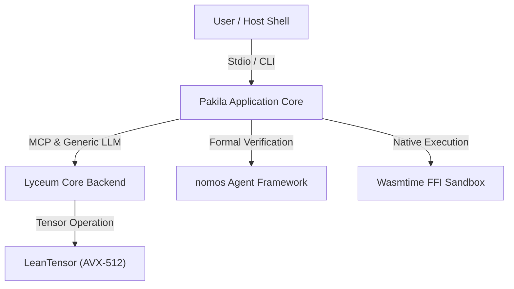

# Pakila コアアーキテクチャ設計書 (Pakila Core Architecture Specification)

## 1. システム概要 (Executive Summary)

`Pakila` は、定理証明支援系 **Lean 4** を用いて構築された、証明可能な正しさと型安全性を備えた自律型インタプリタエンジンである。
本システムは、Wasmtime サンドボックス、Any-To-Any マルチモーダル処理基盤、並びに `Lyceum` / `nomos` / `LeanTensor` / `lbir` を透過的に統合し、物理境界における圧倒的な堅牢性と型安全な LLM ワークスペースを提供する。

---

## 2. システムコンテキスト & C4 アーキテクチャ

### 2.1. Level 1: System Context (システムコンテキスト)

### 2.2. Level 2: Container & Component Architecture

1. **`Pakila.Core.Machine`**:
   - 決定論的状態遷移機械。プロンプト受信、レスポンス管理、モナド実行の制御軸。
2. **`Pakila.Core.Environment` / `Pakila.Core.Interface`**:
   - Stdio 及び Physical Terminal 操作を抽象化する型クラス層。
3. **`Pakila.Plugin` & `Pakila.Core.Wasm`**:
   - C FFI を介した Wasmtime サンドボックス分離実行エンジン。
4. **`Pakila.Memory`**:
   - VectorDB 及び物理埋め込み（Embedding）による RAG コンテクスト検索エンジン。
5. **`Pakila.MainLoop`**:
   - `nomos` の `Agent` 契約に従う不変状態検証付きメインループ。

---

## 3. 構造化意思決定記録 (ADR: Architectural Decision Records)

### ADR-001: Wasmtime FFI サンドボックス分離
- **ステータス**: 承認済 (Accepted)
- **文脈**: サードパーティツールや外部動的コードの実行時にメインプロセスのメモリ破壊や OS 破壊を防ぐ必要がある。
- **決定**: `-lwasmtime` FFI を介した隔離サンドボックス環境を構築し、外部コマンド・コードを安全にカプセル化する。
- **帰結**: 不正コード実行時も本体プロセスはパニックせず、`AppError.ExecutionError` へ安全にフォールバック。

### ADR-002: Lyceum バックエンドとの透過的モナド接続
- **ステータス**: 承認済 (Accepted)
- **文脈**: リモート Gemini API とローカル GGUF (Gemma) モデルの切替を意識させない透過的な推論パイプラインを確保する。
- **決定**: `Lyceum` の `LlmBackend` インタフェースを統一採用し、`Pakila` から一元的に呼び出し可能とする。

### ADR-003: 日本語 / マルチバイト文字分析と Symbol32 規格
- **ステータス**: 承認済 (Accepted)
- **文脈**: 日本語・マルチバイト文字列のトークナイズ処理における文字化けや境界切り出しエラーを防ぐ。
- **決定**: 文字コード体系を `Symbol32` / UTF-8 バイト境界安全処理に統一する。

---

## 4. 型システムと数理的堅牢性 (Formal Type Safety)

- **状態遷移の非破壊性**: Lean 4 の依存型システムにより、未定義状態への遷移および不正データ構造の混入をコンパイル時に静的排除。
- **物理境界防腐層**: OS レイヤーとの接続（Stdio, File, Process, FFI）はすべて `IO` モナドおよび明示的エラー型へカプセル化。

---
*Document Status: Active & Fully Synchronized with doc-governor*
